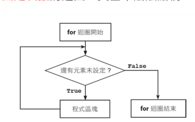
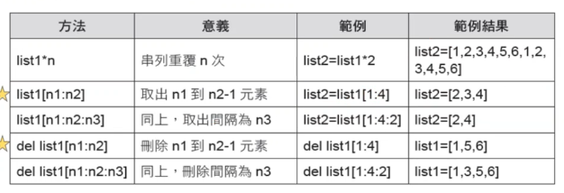
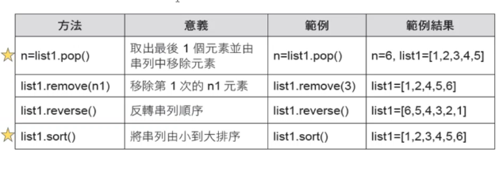
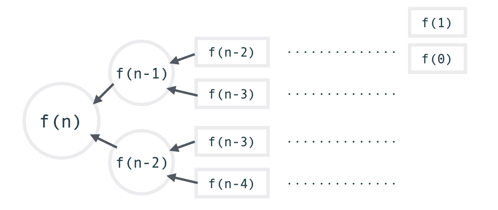

### 註解

"""

多行註解

"""

\#單行註解

### 縮排
python一定要縮排不然會報錯
tab鍵可以整齊的將縮排一致
`shift+tab`反縮排

### 型態
Python 的內建型態主要分為以下三種：

1. 數值型態：int, float, bool,complex
2. 字串型態：str, chr
3. 容器型態：list, dict, tuple,set

`Python 3後，整數型態一率為int，不再區分整數（int）與長整數（long），而且整數的長度沒有限制。`

不想要讓`+-*/`變成數值做運算
要加上`" "`
e.g. `print("a=" + a + "b=" +b +"c="+c)`

### 指定值
python變數不需要宣告就可以使用

is `py = 1` not
`int py = 1`

### 變數命名
1、可以使用英文字母小寫a到z、大寫a到z、數字0到9、底線_

2、第一個字不能為數字

3、Python名程區分大小寫，a跟A為不同的變數名稱

4、英文字母大小寫視為不同變數名稱

5、不可使用保留字

有些字以經被Python本身拿去使用，成為保留字或關鍵字，以下是保留字

[`False`, `None`, `True`, `__peg_parser__`, `and`, `as`, `assert`, `async`, `await`, `break`, `class`, `continue`, `def`, `del`, `elif`, `else`, `except`, `finally`, `for`, `from`, `global`, `if`, `import`, `in`, `is`, `lambda`, `nonlocal`, `not`, `or`, `pass`, `raise`, `return`, `try`, `while`, `with`, `yield`]

如果使用保留字，出錯提示:
SyntaxError: invalid syntax(語法錯誤：無效的語法)

### 跳脫字元
以`\`開頭，後面接一定格式的字元代表特定意義

`\t  Tab鍵`
`\n  換行`

### 輸出
整數補空白，小數補0

正數靠右對齊

負數靠左對齊

### 輸入
`input`跟`print`是相反的

### 運算
`/`     相除

`%`     取餘

`//`    取整商

`**`    次方

### 關係運算子
**比較兩個運算式**

結果正確回傳`True`

結果錯誤回傳`False`

### 邏輯運算式
`AND` (且): 全部符合(True)->二者為真，才為真

`OR`  (或): 部分符合(True)->一者為真，既為真

`NOT` (非): 非真既假

### 複合指定運算
同時做**執行運算** 及 **指定**

加減乘除次方都可以用

`x += 3 <=> x = x + 3`

`x -= 3 <=> x = x - 3`

### Pythonic
python追求簡單優雅的風格， Pythonic 意旨【具有Python風格】的程式碼

`a =3,b=1`

`(1<=b) and (b<=a) and (a<10)`

`(True and True) and True => True`

**Python寫法**

`1<=b<=a<=10 => 1<=1<=3<=10 => True`

### 流程控制 判斷式

`if else` 、 `if elif`是否符合條件進入不同區段

### 巢狀
再判斷式(if..elif..else)內可以有判斷式
+ python 未限制巢狀判斷式層數
+ 層數多會降低可讀性，且維護困難

### 迴圈
處理大量資料，減少程式複雜性

### 串列
+ 清單、列表。類似其他程式語言的陣列，提供儲存資料的記憶體空間
+ 元素的資料型態可以不同
+ 元素不在列表中會出錯
+ -1是倒數元素，由後往前找
+ 無法連續倒數列表

### range 
range(起始值，中止值，間隔值)
產生一整數數列的串列動作

### for 可數迴圈
  

for 迴圈可指定執行次數
    for 變數 in 串列
        comm..

### 巢狀迴圈
迴圈中有迴圈
外層要等內層迴圈跑完

### break
迴圈執行時如果要中途結束迴圈執行，可使用該命令強制離開

### continue
再迴圈執行中途停止不往下執行，跳到迴圈起始處繼續執行

### 串列
list1 = [1,2,3,4,5,6,7]

  
  

+ list[1:4] ->2,3,4再py中所有尾數要-1取

lst.append(lst1) #[3, 5, 7, [2, 4, 6, 8]]

lst.extend(lst1) #lst延伸了lst1=>[3, 5, 7, 2, 4, 6, 8]

#n = lst.pop() #=> 最後的元素刪除=>n
print(lst.pop()) #顯示最後的元素並刪除=>6，lst=[1,2,3,4,5]

### 集合
集合是無序、元素不重複的群集，語法如下：

+ 集合名稱 = {“元素1”, “元素2”, ...}

集合的操作
+ 若一個集合名稱為 test_set，則利用
+ test_set.add(e) 對集合進行加入元素 
+ test_set.remove(e) 對集合進行移除元素 
+ 也可在集合中使用 len(), min(), max(), sum() 或 for 迴圈拜訪集合內的所有元素

### 變數
全域變數-函式外
區域變數-函式內

### 讀寫檔案
加with的話可以在程式後面不用加f.close()

### 遞迴
recursion 的概念即是不斷地呼叫自已
  
